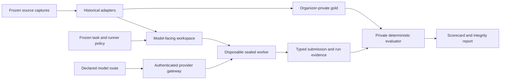

# VaxReplay architecture

VaxReplay separates benchmark construction, model execution, and private scoring so that a model
sees only the evidence permitted at the decision cutoff.

## Construction boundary

Historical adapters normalize source-specific records into explicit decision-time and outcome-time
artifacts. A task release binds the visible workspace, cutoff, task definition, policy, and private
gold commitments. Evidence published after the cutoff belongs only on the outcome side.

Retrospective reconstruction does not by itself prove that the decision-time surface is
contamination-free. VaxReplay therefore records provenance tiers and keeps retrospective research
results separate from future prospectively sealed results.

## Execution boundary

A submitted system is defined by its model route, harness, executable identity, tools, configuration,
and resource budget. The intended sealed worker receives:

- one approved logical workspace;
- bounded scratch space;
- authenticated list, read, and search operations;
- mediated access to the declared model route; and
- one typed terminal-submission channel.

It does not receive private labels, scorer code, organizer credentials, the organizer filesystem,
or general network access. One retained attempt may contain multiple ordered model and workspace
tool calls. A failed attempt is not silently replaced by a more favorable retry.

## Scoring boundary

The private evaluator validates the terminal submission, verifies its release and execution
bindings, and computes deterministic outcome and process metrics. Scorecards must report validity,
failure, calibration, cost, latency, and contamination diagnostics alongside reward.

Simple no-evidence and empirical-prior baselines are required. If they saturate a metric, the task
or reward is not discriminative enough for comparative use.

## Comparison tracks

VaxReplay reports two system comparisons separately:

1. **Fixed-harness model track:** the same benchmark-native harness and tools are used across model
   routes.
2. **Harness-plus-model track:** each submitted agent system includes its own qualified harness.

The first track isolates model differences more cleanly. The second measures a broader agent system
but introduces additional scaffolding, tool, and budget differences.

## Current status

The repository contains development implementations of these boundaries and fictional conformance
fixtures. It does not contain an admitted real-data benchmark, independently qualified production
deployment, or official leaderboard. See [Technical-preview scope](alpha_scope.md).
