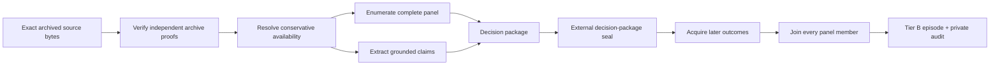

# Tier B literature replay

Tier B is VaxReplay's independently archived retrospective research track. It is intentionally
separate from the Tier A official leaderboard and the Tier C synthetic integration pilot.

## Fictional conformance fixture

The existing IEDB-shaped fixture uses invented papers, assay rows, candidate identifiers, and labels.
Its schemas, hashes, HMAC commitments, isolation boundary, scorer, and adversarial tests are real;
its biological evidence is not. It demonstrates that the machinery is wired correctly, not that a
model can prioritize real immune targets. It is not a pilot scientific benchmark and contributes no
leaderboard score.

Tier B is the first path intended to carry real biological records. Its unit tests still use
fictional fixtures, but production admission rejects `synthetic: true` and fixture-only archive
authorities.

## Scientific task

At a historical cutoff, a system receives a frozen set of independently archived publications and
a complete candidate panel enumerated from those publications. It must rank the candidates,
forecast prespecified later assay outcomes, and support its assessments with exact spans from the
admitted pre-cutoff text. Later outcome records are joined only after the decision package is
sealed.

This is longer-horizon than peptide-binding prediction alone: literature claims must be extracted,
linked to a predeclared panel, reconciled across evidence dimensions, and turned into a calibrated
portfolio. The model does not choose the opportunity set and cannot retrieve arbitrary literature
during evaluation.

## Two-stage data boundary



The decision-stage API has no outcome argument. The later join must retain every frozen panel
member, including missing, conflicting, or censored results, and records unmatched outcome rows
without adding them to the panel. V1 scoring still requires complete observed ranking grades, so a
separate sealed case-universe and exhaustive case-selection audit records every whole case that is
excluded for missing or conflicting later outcomes. This prevents completeness filtering from
silently selecting the evaluated cohort.

The implemented Python boundary is:

```text
verify_decision_package(decision_root, decision_package, archive/panel/extraction/seal verifiers)
    -> VerifiedDecisionPackage

verify_outcome_package(
    outcome_root,
    outcome_package,
    verified_decision,
    outcome-source verifier,
    outcome-archive-proof verifier,
)
    -> VerifiedOutcomePackage

build_literature_episode(verified_decision, verified_outcome, HMAC key, trusted verifiers)
    -> V1 EpisodeBundle + private LiteratureSourceAudit
```

`LiteratureEvaluationConfig` is embedded in and hashed by the decision package before outcomes are
joined. Portfolio size, target/horizon, required dimensions, lineage, split, and adjudication
therefore cannot be chosen after labels are visible. Episode records are then derived twice—during
build and release verification—and must exactly match the source audit, scoring bundle, raw outcome
bytes, protocol artifacts, and Tier B temporal admission.

The extraction verifier authenticates a runner receipt binding the extractor code/model, prompt,
configuration, no-network policy, and absence of an outcome namespace. The panel verifier is a
source-specific deterministic enumerator; a literal `complete: true` flag is never sufficient on
its own.

## Proof and screening layers

Tier B needs four provenance layers and one distinct contamination screen:

1. Source archive proofs bind each exact paper or dataset version to an independently authenticated
   public-availability time at or before the historical cutoff.
2. A decision-package seal binds the derived corpus inventory, complete panel, extraction output,
   and decision/outcome protocols before the outcome join begins.
3. An outcome archive proof independently binds the exact later-outcome bytes and their conservative
   first availability time.
4. A pre-outcome case-universe seal plus an exhaustive post-outcome case-selection audit exposes
   predefined exclusions, missing cases, conflicts, and every admitted episode.
5. A release-bound contamination audit compares the exact final model-facing view with protected
   later material using deterministic retrieval, calibrated structured LLM review, and a fixed
   pass/manual-review/quarantine rule. Every preeligible case is covered, and quarantined cases
   remain visible in the selection audit.

The four existing temporal receipts still bind the derived candidate, evidence, decision, and
outcome artifacts. They do not replace source-level archive proofs. An LLM may extract structured
claims only from already admitted bytes, with exact spans and a pinned prompt/model/config; it may
not establish timestamps, enumerate candidates, or filter the panel.

The contamination auditor is also not a timestamp authority or scientific labeler. It is an
organizer-side quality-control system. Two or more pinned judges must cite exact byte spans; their
outputs, prompt/config/model commitments, calibration results, and protected comparisons remain in
the private release. The public admission commits the common audit policy and complete manifest
hash. The release builder accepts only passing cases and independently recomputes the exact `full`
model-facing prompt bytes. See the [threat model](threat_model.md) for the limits of contamination
controls.

A passing audit means `no_signal_detected_under_pinned_screen`; it does not prove that a submitted
model has not memorized the later result. Model-specific recall and reidentification probes are a
separate diagnostic layer.

## Admission and execution claims

| Track | Biological data | Temporal claim | Leaderboard claim |
|---|---|---|---|
| Tier C conformance fixture | fictional | retrospective plumbing only | none |
| Tier B literature replay | real archived sources and later outcomes | independently archived retrospective | separate research leaderboard |
| Tier A prospective replay | real, frozen before outcomes | prospective seal | official leaderboard |

Tier B releases use HMAC label commitments and one-shot sealed execution even though they are not
Tier A. Runtime secrecy prevents the submitted harness from reading private labels; it does not
upgrade retrospective provenance into a prospective claim.

## First real-case inventory

Prachar et al. is a useful adapter-development case because the open paper reports a deterministic
panel construction and measurements for 777 unique peptides across 11 HLA alleles, and its Zenodo
dataset is CC BY 4.0. It is not currently admissible as a clean Tier B episode: the earliest public
Zenodo version already describes the 174 validated epitopes, so it does not provide an independent,
pre-outcome freeze of the full measured panel. It remains a conformance/development candidate until
an earlier independently archived panel artifact is found.

- Paper: <https://doi.org/10.1038/s41598-020-77466-4>
- Dataset: <https://doi.org/10.5281/zenodo.3715339>

No real episode should be advertised as Tier B until its exact source bytes, archive proofs, panel
completeness, outcome join, outcome proof, sealed case universe, exhaustive selection audit,
licenses, and private source audit all pass the production verifier. The repository currently has
the contracts and a wholly fictional conformance fixture; it does not yet contain an admitted real
Tier B evalset.
